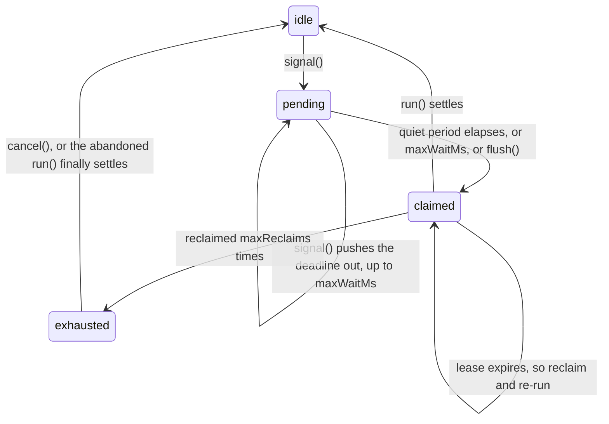

# @samstarling/cloudflare-utils-debounce

Collapses a burst of events into a single downstream action that runs at most once at a time globally, even under concurrent triggers, retries and process crashes. Built on Cloudflare Durable Objects, with no other infrastructure.

```sh
npm install @samstarling/cloudflare-utils-debounce
```

Part of [cloudflare-utils](https://github.com/samstarling/cloudflare-utils). See
[`examples/debounce`](https://github.com/samstarling/cloudflare-utils/tree/main/examples/debounce)
for a runnable Worker exercising everything below.

Events are debounced by key, and each key moves through four states:



`claimed` means `run()` is executing. Anything arriving while the key is `claimed` will be queued and executed when the run ends, so the key never runs twice at once. `exhausted` is a terminal state: it means a `run()` never settled and has stopped being reclaimed.

## Integration

Durable Objects can't be a zero-config import: you declare a binding and a migration in your own `wrangler.jsonc`, pointing at a concrete subclass that implements `run()`.

```ts
import { DebounceAndLease } from "@samstarling/cloudflare-utils-debounce";

export class MyDebounceAndLease extends DebounceAndLease<Env> {
  constructor(ctx: DurableObjectState, env: Env) {
    super(ctx, env, { 
      quietPeriodMs: 60_000, 
      leaseDurationMs: 5 * 60_000,
    });
  }

  protected async run(key: string, epoch: number): Promise<void> {
    // do some work
  }
}
```

The `wrangler.jsonc` migration must use `new_sqlite_classes`, since this library relies on the SQLite-backed storage API for its concurrency guarantees:

```jsonc
{
  "durable_objects": {
    "bindings": [
      { "name": "DEBOUNCE_BINDING", "class_name": "MyDebounceAndLease" }
    ]
  },
  "migrations": [
    { "tag": "v1", "new_sqlite_classes": ["MyDebounceAndLease"] }
  ]
}
```

There's no `key` argument on any of the methods. Instead, you pick the key by choosing which Durable Object you talk to, by passing it to `getByName()`:

```ts
const stub = env.DEBOUNCE_BINDING.getByName(key);
await stub.signal();
```

`status()` returns a `DebounceAndLeaseStatus`, a union discriminated on `state`, carrying the relevant deadline and a `coalescedPending` flag. Narrow on `state` and let the exported types guide you.

## Choosing a key

**Key on the unit of output, not the unit of input.** If many inputs collapse into one action, the key names that action's target, not the thing that triggered it. Scraping several sources per customer and regenerating one summary each time any of them changes means the key is the customer, not the source:

```ts
// a source belonging to customer C changed
await env.SUMMARY_DEBOUNCE.getByName(customerId).signal();
```

That gives you one debounce window and one summary regeneration per customer, and keeps the key space at customer cardinality rather than source cardinality — which matters for storage (see [Cost](#cost)).

`run()` receives only `(key, epoch)`, so if your action needs to know *what* changed, keep that in the Durable Object. A subclass method that records and signals in one RPC is usually all it takes:

```ts
export class SummaryDebounce extends DebounceAndLease<Env> {
  async sourceChanged(sourceId: string) {
    this.ctx.storage.kv.put(`dirty:${sourceId}`, Date.now());
    return this.signal();
  }

  protected async run(key: string, epoch: number) {
    const dirty = [...this.ctx.storage.kv.list({ prefix: "dirty:" })].map(([k]) => k.slice(6));
    const summary = await generate(key, dirty, AbortSignal.timeout(120_000));
    if (!this.isCurrentEpoch(epoch)) return; // fence before the write
    await writeSummary(this.env, key, summary);
    for (const id of dirty) this.ctx.storage.kv.delete(`dirty:${id}`);
  }
}
```

Two things that shape this design:

- **One key per Durable Object, always.** The key *is* the object's id name, which is what lets a single alarm serve as that key's timer. A single object debouncing many keys would need its own scheduler and would serialize every caller behind one isolate; prefer one object per key and let the platform spread them out.
- **The `__debounce:` prefix is reserved.** Subclasses share the same `storage.kv` namespace, so everything this library persists is prefixed. Namespace your own keys (as `dirty:` does above) and you can't collide with it.

## Bounding the wait

Every `signal()` pushes the deadline out by `quietPeriodMs`. On a key that keeps being signalled faster than that, the deadline keeps moving and the action never runs at all. Set `maxWaitMs` to put a ceiling on it:

```ts
super(ctx, env, {
  quietPeriodMs: 60_000,
  maxWaitMs: 10 * 60_000, // run at least every 10 minutes while signals keep arriving
  leaseDurationMs: 5 * 60_000,
});
```

The effective deadline becomes `min(now + quietPeriodMs, pendingSince + maxWaitMs)`, measured from the signal that first made the key pending, so it only ever pulls the run earlier. The window restarts on the next cycle. Setting `maxWaitMs` below `quietPeriodMs` turns the key into a throttle that fires every `maxWaitMs` — fine, if that's what you want.

## The guarantee

At most one execution is in flight per key, except for a bounded window right after an unreleased execution's lease expires. In that window a second execution may legitimately start before the first is confirmed finished.

Retries are lease-driven, not error-driven:

- A `run()` that **throws** is not retried. The key returns to idle once `onRunError` fires, and nothing runs again until a new `signal()`/`flush()` arrives.
- A `run()` that **hangs or is silently killed** is retried every `leaseDurationMs` until it settles, or until `maxReclaims` is hit and the key goes `exhausted`.

Actions that aren't safe to run twice need their own downstream idempotency. This library doesn't provide that. The `epoch` might help you: see below.

## Important points

- **In-flight calls coalesce.** A `signal()` or `flush()` arriving mid-execution isn't dropped. Instead, it's queued and run once that execution ends. A queued `signal()` starts a fresh debounce window, a queued `flush()` fires immediately. `flush()` on an idle key is a no-op.
- **`run()` must eventually settle.** No internal timeout is enforced, so give it one of your own, well under `leaseDurationMs`. A `run()` that never settles is reclaimed up to `maxReclaims` times, after which `onExhausted` fires and the key goes `"exhausted"`. Treat `onExhausted` as your alert: it means a key needs `cancel()` to move again. A `signal()`/`flush()` on an exhausted key is queued rather than run, since that abandoned execution may still be alive.
- **Fence your own side effects.** `epoch` identifies the current claim. The library uses it to stop a stale invocation from clobbering its own bookkeeping, but that doesn't protect your side effect. If your action isn't safe to run twice, check `this.isCurrentEpoch(epoch)` immediately before acting: `false` means a reclaim has superseded you and you should stop. This only helps if checked *before* the side effect, and is no substitute for idempotency.
- **Never call `run()` directly on a stub.** It's `protected` at compile time only; Cloudflare's RPC exposes it at runtime regardless, and calling it bypasses the state machine. Only `signal()`, `flush()`, `status()` and `cancel()` are the public contract.
- **Storage keys under `__debounce:` belong to the library.** Your subclass shares the same `storage.kv`, so prefix what you persist. A bare `state` or `claimEpoch` would have corrupted the state machine silently rather than failing loudly, which is why the library's own keys are namespaced.
- **A continuously-signalled key never runs without `maxWaitMs`.** See [Bounding the wait](#bounding-the-wait).

## Configuration

| Option | Meaning |
|---|---|
| `quietPeriodMs` | How long a key must go without a new signal before its action runs. |
| `maxWaitMs` | Optional ceiling on how long a key may stay pending before running anyway, measured from the signal that first made it pending. Unset means no ceiling, so a continuously-signalled key never runs. |
| `leaseDurationMs` | How long a claimed execution may run before it's presumed dead and the key becomes eligible again. |
| `maxReclaims` | How many times a lease may expire on the same unconfirmed execution before the key goes `"exhausted"`. Defaults to 10 (exported as `DEFAULT_MAX_RECLAIMS`); pass `Infinity` to retry forever. |
| `onRunError` | Optional `(error, key) => void` called when `run()` throws. The error is otherwise swallowed; recovery timing is governed by the lease, not by rethrowing. |
| `onExhausted` | Optional `(key, reclaimCount) => void` called once `maxReclaims` is exceeded and the key goes `"exhausted"`. No further reclaim is scheduled. |

## Cost

Two points about Cloudflare's billing for Durable Objects:

- **Debouncing doesn't reduce your request count.** Each `signal()` is its own billed RPC request, and so is each alarm invocation. Collapsing 1,000 signals into one action saves the downstream work, not the 1,000 requests. If the signals originate from something that can batch — a Queue consumer, say — batching there is what cuts the request count, by turning N events into one `signal()` per key per batch.
- **Storage is per key, and keys are never cleaned up automatically.** A Durable Object that has run and gone idle still holds roughly 12 KB, because the fencing token that stops a late `run()` clobbering newer state has to outlive the run. Nothing expires it. Low-cardinality keys such as tenant or queue names are fine — see [Choosing a key](#choosing-a-key). A key per upload or per document ID accumulates indefinitely, and reclaiming that storage with `deleteAll()` is left up to you.
